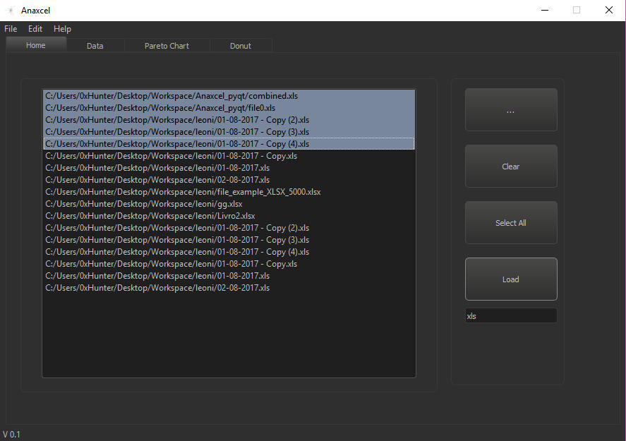
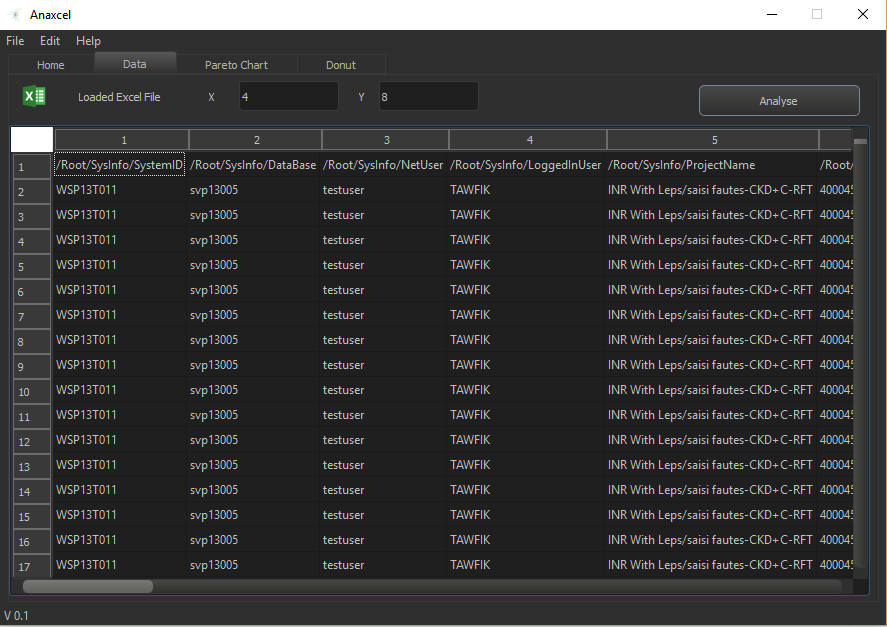
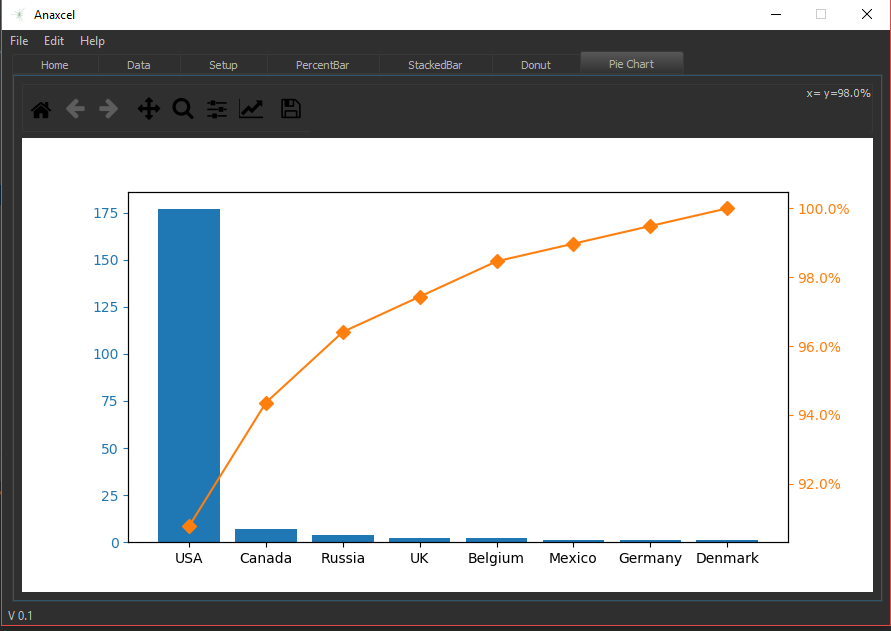
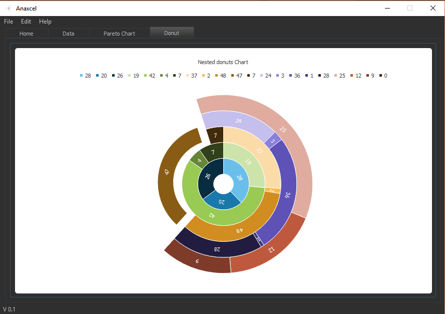
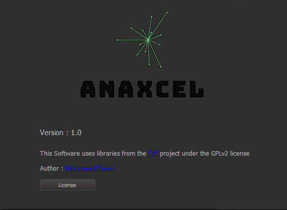

--------------------------------------------------------------------------------------------------------------------------

# Anaxcel_PyQt5

A Python-based, open source, desktop application to import, read and analyse excel files in order to create and display multiple charts.

Anaxcel is Free Software under a GPLv2 license.

## Getting Started

These instructions will get you a copy of the project up and running on your local machine for development and testing purposes. See deployment for notes on how to deploy the project on a live system.

### Prerequisites


To be able to run this Program make sure you have the necessary packages installed on your machine:

####PyQt5:

Mainly use the following command under the cmd
```
pip install PyQt5
```
If that did not work, you might try this link from SourceForge [PyQt5 .exe installers for Windows](https://sourceforge.net/projects/pyqt/files/PyQt5/).

install OpenPYXL in Python:

```
pip install openpyxl
```
If you need to include images into an openpyxl file, you will also need the “pillow” library that can be installed with:

```
pip install pillow
```

## Running 

Simply run the main script <anaxcel.py>.

```
python anaxcel.py
```

First start by loading a couple of excel files to the application. You can choose to load a display a single file or select multiple files. 


The process will combine the selected files and load them for you .



Select what columns you wish to be the axis of the chart then hit analyse.The program will set focus on the newly generated Pareto Chart.



As a bonus we wanted to include multiple charts such the Donut chart. Unfortunatly , this is still a work in progress.




## Authors

   
   

## License

This document and the attached source code are released under GNU General Public License Version 2. See the accompanying file LICENSE for a copy.


